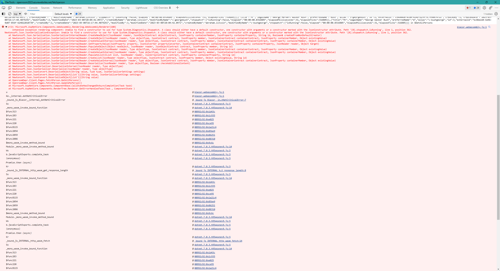

```
crit: Microsoft.AspNetCore.Components.WebAssembly.Rendering.WebAssemblyRenderer[100]
      Unhandled exception rendering component: Unable to find a constructor to use for type System.Diagnostics.Stopwatch. A class should either have a default constructor, one constructor with arguments or a constructor marked with the JsonConstructor attribute. Path '[0].stopwatch.isRunning', line 1, position 362.
Newtonsoft.Json.JsonSerializationException: Unable to find a constructor to use for type System.Diagnostics.Stopwatch. A class should either have a default constructor, one constructor with arguments or a constructor marked with the JsonConstructor attribute. Path '[0].stopwatch.isRunning', line 1, position 362.
   at Newtonsoft.Json.Serialization.JsonSerializerInternalReader.CreateNewObject(JsonReader reader, JsonObjectContract objectContract, JsonProperty containerMember, JsonProperty containerProperty, String id, Boolean& createdFromNonDefaultCreator)
   at Newtonsoft.Json.Serialization.JsonSerializerInternalReader.CreateObject(JsonReader reader, Type objectType, JsonContract contract, JsonProperty member, JsonContainerContract containerContract, JsonProperty containerMember, Object existingValue)
   at Newtonsoft.Json.Serialization.JsonSerializerInternalReader.CreateValueInternal(JsonReader reader, Type objectType, JsonContract contract, JsonProperty member, JsonContainerContract containerContract, JsonProperty containerMember, Object existingValue)
   at Newtonsoft.Json.Serialization.JsonSerializerInternalReader.SetPropertyValue(JsonProperty property, JsonConverter propertyConverter, JsonContainerContract containerContract, JsonProperty containerProperty, JsonReader reader, Object target)
   at Newtonsoft.Json.Serialization.JsonSerializerInternalReader.PopulateObject(Object newObject, JsonReader reader, JsonObjectContract contract, JsonProperty member, String id)
   at Newtonsoft.Json.Serialization.JsonSerializerInternalReader.CreateObject(JsonReader reader, Type objectType, JsonContract contract, JsonProperty member, JsonContainerContract containerContract, JsonProperty containerMember, Object existingValue)
   at Newtonsoft.Json.Serialization.JsonSerializerInternalReader.CreateValueInternal(JsonReader reader, Type objectType, JsonContract contract, JsonProperty member, JsonContainerContract containerContract, JsonProperty containerMember, Object existingValue)
   at Newtonsoft.Json.Serialization.JsonSerializerInternalReader.PopulateList(IList list, JsonReader reader, JsonArrayContract contract, JsonProperty containerProperty, String id)
   at Newtonsoft.Json.Serialization.JsonSerializerInternalReader.CreateList(JsonReader reader, Type objectType, JsonContract contract, JsonProperty member, Object existingValue, String id)
   at Newtonsoft.Json.Serialization.JsonSerializerInternalReader.CreateValueInternal(JsonReader reader, Type objectType, JsonContract contract, JsonProperty member, JsonContainerContract containerContract, JsonProperty containerMember, Object existingValue)
   at Newtonsoft.Json.Serialization.JsonSerializerInternalReader.Deserialize(JsonReader reader, Type objectType, Boolean checkAdditionalContent)
   at Newtonsoft.Json.JsonSerializer.DeserializeInternal(JsonReader reader, Type objectType)
   at Newtonsoft.Json.JsonSerializer.Deserialize(JsonReader reader, Type objectType)
   at Newtonsoft.Json.JsonConvert.DeserializeObject(String value, Type type, JsonSerializerSettings settings)
   at Newtonsoft.Json.JsonConvert.DeserializeObject[List`1](String value, JsonSerializerSettings settings)
   at Newtonsoft.Json.JsonConvert.DeserializeObject[List`1](String value)
   at OpenroomDapr.Client.Pages.FetchPerson.GetAllPersons()
   at OpenroomDapr.Client.Pages.FetchPerson.UpdateMyPerson()
   at Microsoft.AspNetCore.Components.ComponentBase.CallStateHasChangedOnAsyncCompletion(Task task)
   at Microsoft.AspNetCore.Components.RenderTree.Renderer.GetErrorHandledTask(Task , ComponentState )
```